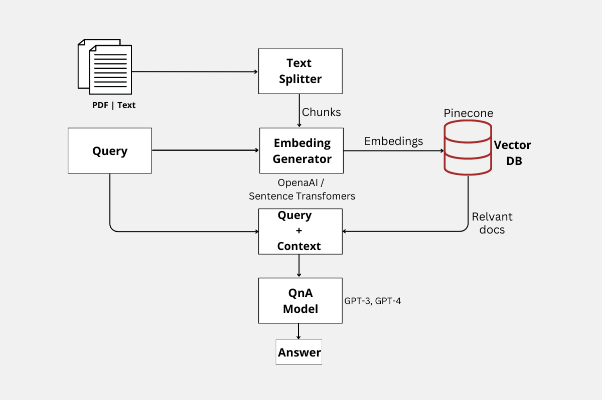

## Retrieval-Augmented-QnA



# Try it yourself:
**!! Please set your OPENAI KEY and PINECONE KEYs as required, refer to init_setup.py for required ENV variables !!**

```
pip install -r requirements.txt
pip install detectron2@git+https://github.com/facebookresearch/detectron2.git@d1e04565d3bec8719335b88be9e9b961bf3ec464
cd ./app
streamlit run main.py
```

OR:
Create .secrets file with the following :

>OPENAPI_KEY=

>PINECONE_API_KEY=

>PINECONE_ENV=

then,

```
docker build -t demopubmedqa .
docker run -it -p 8501:8501 --env-file .secrets demopubmedqa env
```
